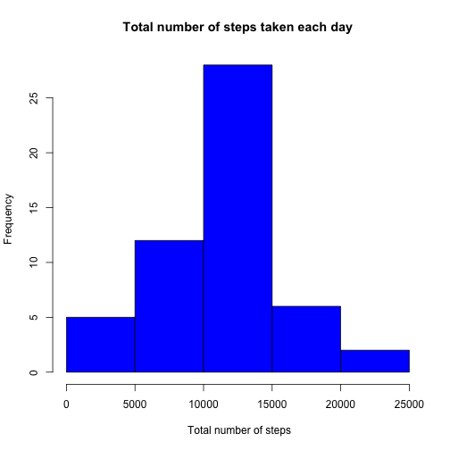
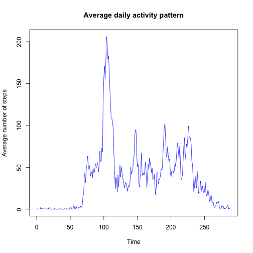
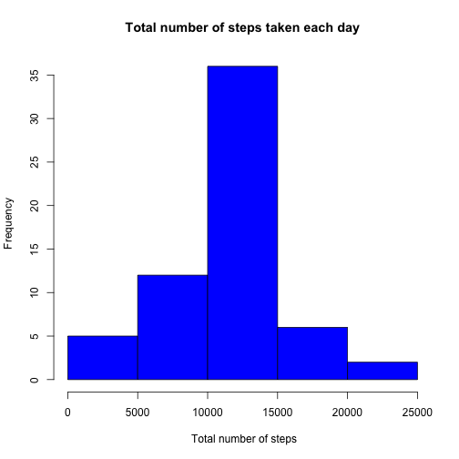
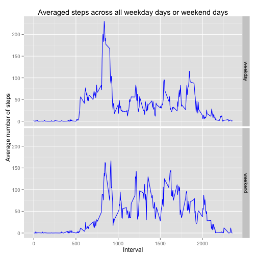

# Reproducible Research: Peer Assessment 1

```r
#load packages
library("ggplot2")

#get english localization settings
Sys.setlocale("LC_TIME", "en_GB")
```
Make sure the `activity.csv` file is in your working directory.


<br><br>
## Loading and preprocessing the data

```r
#load data
activity <- read.csv("activity.csv")

#data column from factor to date class
activity$date <- as.Date(activity$date)
```

<br><br>
## What is mean total number of steps taken per day?

```r
#sum the number of steps per day
total_steps <- tapply(activity$steps, activity$date, sum)

hist(total_steps, col="blue", main = "Total number of steps taken each day", xlab = " Total number of steps")
```

 

_Figure 1: Histogram of the total number of steps taken each day. On the x-axis you see the number of steps, and on the y-axis the number of days_


```r
mean(total_steps, na.rm=TRUE)
```

```
## [1] 10766
```

```r
median(total_steps, na.rm=TRUE)
```

```
## [1] 10765
```

The mean total number of steps taken per day is `10766` and the median total number of steps taken per day is `10765`.

<br><br>
## What is the average daily activity pattern?

```r
average_steps <- tapply(activity$steps, activity$interval, mean, na.rm=TRUE)

plot(average_steps, type="l", col="blue", main = "Average daily activity pattern", 
     xlab= "Time", ylab="Average number of steps" )
```

 

_Figure 2: Time series plot of the 5-minute interval (x-axis) and the average number of steps taken, averaged across all days (y-axis)._


```r
names(average_steps[which.max(average_steps)])
```

```
## [1] "835"
```

The 5-minute interval that contains the maximum number of steps on average across all the days in the dataset is interval `835`.

<br><br>
## Imputing missing values


```r
sum(is.na(activity))
```

```
## [1] 2304
```

The total number of missing values in the dataset is `2304`.

**Strategy for filling in all of the missing values in the dataset:**
* Create an extra column that contains the averge steps per 5 min interval
* If the number of steps is `NA` replace the value with the value in the averege_steps columns


```r
#Create a new dataset that is equal to the original dataset but with the missing data filled in.
d<-activity
d$average_steps <- average_steps
d[is.na(d),]$steps <- d[is.na(d),]$average_steps
```


```r
total_steps2 <- tapply(d$steps, d$date, sum)

hist(total_steps2, col="blue", main = "Total number of steps taken each day", xlab = " Total number of steps")
```

 

_Figure 3: Histogram of the total number of steps taken each day after filling in the missing values. On the x-axis you see the number of steps, and on the y-axis the number of days._


```r
mean(total_steps2)
```

```
## [1] 10766
```

```r
median(total_steps2)
```

```
## [1] 10766
```
The mean total number of steps taken per day is `10766` and the median total number of steps taken per day is `10766`.

After filling in the missing values the mean remains the same, however the median is now identical to the mean. 

<br><br>
## Are there differences in activity patterns between weekdays and weekends?


```r
#Create a new factor variable in the dataset with two levels  "weekday" and "weekend" 
d$day <- as.factor(weekdays(d$date))

levels(d$day)<- list(weekday = c("Monday", "Tuesday", "Wednesday", "Thursday", "Friday"),
                     weekend = c("Sunday", "Saturday"))
```


```r
ggplot(data=d, aes(interval,steps)) + facet_grid(day~.) + 
        stat_summary(fun.y=mean, col="blue", geom="line") +
        xlab("Interval") + ylab("Average number of steps") +
        ggtitle("Averaged steps across all weekday days or weekend days")
```

 

_Figure 4: Panel plot containing a time series plot of the 5-minute interval (x-axis) and the average number of steps taken, averaged across all weekday days or weekend days (y-axis)._


<br><br>
## References
* H. Wickham. ggplot2: elegant graphics for data analysis. Springer New York, 2009.
* Yihui Xie (2014). knitr: A general-purpose package for dynamic report generation in R. R package version 1.6.
* Yihui Xie (2013) Dynamic Documents with R and knitr. Chapman and Hall/CRC. ISBN 978-1482203530


<br><br>
## Session Info

```r
sessionInfo()
```

```
## R version 3.1.0 (2014-04-10)
## Platform: x86_64-apple-darwin13.1.0 (64-bit)
## 
## locale:
## [1] nl_NL.UTF-8/nl_NL.UTF-8/nl_NL.UTF-8/C/en_GB/nl_NL.UTF-8
## 
## attached base packages:
## [1] stats     graphics  grDevices utils     datasets  methods   base     
## 
## other attached packages:
## [1] ggplot2_1.0.0 knitr_1.6    
## 
## loaded via a namespace (and not attached):
##  [1] colorspace_1.2-4 digest_0.6.4     evaluate_0.5.5   formatR_0.10    
##  [5] grid_3.1.0       gtable_0.1.2     labeling_0.2     MASS_7.3-33     
##  [9] munsell_0.4.2    plyr_1.8.1       proto_0.3-10     Rcpp_0.11.1     
## [13] reshape2_1.4     scales_0.2.4     stringr_0.6.2    tools_3.1.0
```
